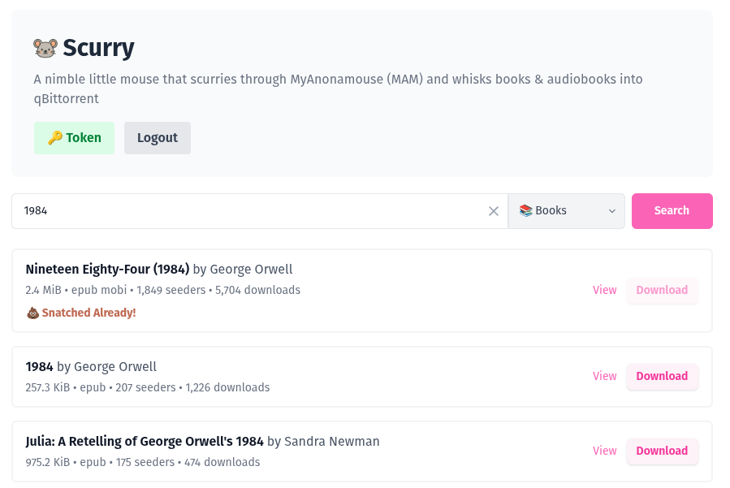
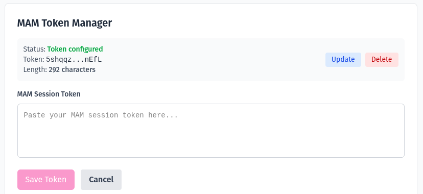

# Scurry
A nimble little mouse that scurries through MyAnonamouse (MAM) and whisks torrents into qBittorrent.

[](https://github.com/masonfox/scurry/pkgs/container/scurry/549862735?tag=latest) [](https://codecov.io/gh/masonfox/scurry)


[](https://www.buymeacoffee.com/masonfox)

## What is Scurry?

**Scurry is a lightweight, self-hosted helper app built for one thing: getting ebook and audiobook torrents from MAM to qBittorrent as fast and simply as possible.** Just a clean, mobile-friendly interface where you can search, tap, and send a torrent straight to your client.

Scurry is perfect for those moments when you’re away from your computer and want to quickly grab something without remote-desktop juggling or digging through the full site. It’s intentionally minimal, fast, and designed to stay out of your way. 

**Just search → tap → done.**



<details> <summary>Token Manager UI</summary>



</details>

### Key Features

- **Search MAM**: Clean, responsive interface to search MyAnonamouse's extensive library
- **One-click Downloads**: Instantly send torrents to your qBittorrent instance with a single click
- **Direct Integration**: Automatically authenticates with both MAM and qBittorrent APIs
- **URL Query Support**: Pre-fill searches using URL parameters (e.g., `?q=search+term`)
- **Smart Filtering**: Filter results by category, seeders, file types, and more
- **Download Management**: Automatic categorization and organization in qBittorrent
- **Authentication**: Simple password protection for your instance
- **Docker Ready**: Easy deployment with Docker Compose

### How It Works

1. **Search**: Enter your search terms in the web interface or use URL parameters (`q=term`)
2. **Browse**: View search results with detailed information (seeders, size, author, etc.)
3. **Download**: Click the download button to automatically add torrents to qBittorrent
4. **Organize**: Torrents are automatically categorized and managed in your qBittorrent instance

### URL Query String Support

You can pre-fill search terms by adding a `q` parameter to the URL:
- `http://localhost:3000/?q=author+name` - Search for a specific author
- `http://localhost:3000/?q=book+title` - Search for a specific book
- `http://localhost:3000/?q=series+name` - Search for a book series

This makes it easy to bookmark searches or integrate with other tools and browser extensions.

## Quick Start
```bash
cp .env.example .env

# Install dependencies
npm install

# Run Dev
npm run dev
# visit http://localhost:3000
```

## Production
I recommend that you leverage the [docker image](https://github.com/masonfox/scurry/pkgs/container/scurry/) for production.

**Via Compose**
```bash
docker compose --build -d
```

**Via Docker Run Script**
```bash
docker run -d \
  --name scurry \
  --pull=always \
  -p 3000:3000 \
  -e APP_PASSWORD=PASSWORD \
  -e APP_QB_URL=URL \
  -e APP_QB_USERNAME=admin \
  -e APP_QB_PASSWORD=PASSWORD \
  -v /VOLUME/scurry:/app/secrets \
  --restart always \
  masonfox/scurry:latest
```